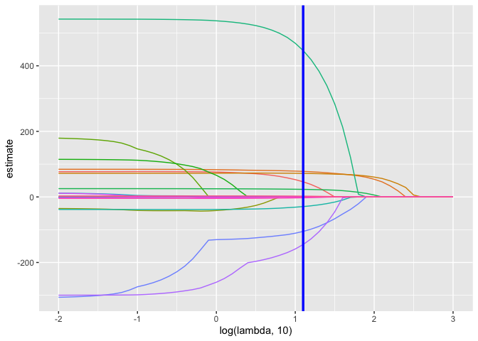

Statistical Learning
================
Tanu
11/26/2019

## R Markdown

``` r
bwt_df = 
  read_csv("extra_topic_data/birthweight.csv") %>% 
  janitor::clean_names() %>%
  mutate(
    babysex = as.factor(babysex),
    babysex = fct_recode(babysex, "male" = "1", "female" = "2"),
    frace = as.factor(frace),
    frace = fct_recode(frace, "white" = "1", "black" = "2", "asian" = "3", 
                       "puerto rican" = "4", "other" = "8"),
    malform = as.logical(malform),
    mrace = as.factor(mrace),
    mrace = fct_recode(mrace, "white" = "1", "black" = "2", "asian" = "3", 
                       "puerto rican" = "4")) %>% 
  sample_n(200)
```

    ## Parsed with column specification:
    ## cols(
    ##   .default = col_double()
    ## )

    ## See spec(...) for full column specifications.

to use the lasso, we look at ‘glmnet’ get inputs for glmnet

``` r
y = bwt_df$bwt
x=model.matrix(bwt~.,bwt_df)[, -1]

lasso_fit = glmnet(x,y)
```

``` r
lambda = 10^(seq(3, -2, -0.1))

lasso_fit =
  glmnet(x, y, lambda = lambda)

lasso_cv =
  cv.glmnet(x, y, lambda = lambda)
lambda_opt = lasso_cv$lambda.min
```

``` r
broom::tidy(lasso_fit) %>% 
  select(term, lambda, estimate) %>% 
  complete(term, lambda, fill = list(estimate = 0)) %>% 
  filter(term != "(Intercept)") %>% 
  ggplot(aes(x = log(lambda, 10), y = estimate, group = term, color = term)) + 
  geom_path() + 
  geom_vline(xintercept = log(lambda_opt, 10), color = "blue", size = 1.2) +
  theme(legend.position = "none")
```

<!-- -->

Cross Validation

``` r
broom::tidy(lasso_cv) %>% 
  ggplot(aes(x = log(lambda, 10), y = estimate)) + 
  geom_point()  
```

<!-- -->

``` r
poke_df =
  read.csv("extra_topic_data/pokemon.csv") %>% 
  janitor::clean_names() %>% 
  select(hp, speed)
```

``` r
poke_df %>% 
  ggplot(aes(x=hp, y=speed)) +
  geom_point()
```

<!-- -->

Clustering

``` r
kmeans_fit= 
  kmeans(poke_df, centers = 3)
```

process and plot results

``` r
poke_df =
  broom::augment(kmeans_fit, poke_df)

poke_df %>% 
  ggplot(aes(x = hp, y = speed, color = .cluster)) +
  geom_point()
```

<!-- -->

``` r
clusts =
  tibble(k = 2:4) %>%
  mutate(
    km_fit =    map(k, ~kmeans(poke_df, .x)),
    augmented = map(km_fit, ~broom::augment(.x, poke_df))
  )

clusts %>% 
  select(-km_fit) %>% 
  unnest(augmented) %>% 
  ggplot(aes(hp, speed, color = .cluster)) +
  geom_point(aes(color = .cluster)) +
  facet_grid(~k)
```

<!-- -->

Clustering Trajectories

``` r
traj_data = 
  read_csv("extra_topic_data/trajectories.csv")
```

    ## Parsed with column specification:
    ## cols(
    ##   subj = col_double(),
    ##   week = col_double(),
    ##   value = col_double()
    ## )

``` r
traj_data %>% 
  ggplot(aes(x = week, y = value, group = subj)) + 
  geom_point() + 
  geom_path()
```

<!-- -->

Doing it by hand

``` r
int_slope_df = 
  traj_data %>% 
  nest(data = week:value) %>% 
  mutate(
    models = map(data, ~lm(value ~ week, data = .x)),
    result = map(models, broom::tidy)
  ) %>% 
  select(subj, result) %>% 
  unnest(result) %>% 
  select(subj, term, estimate) %>% 
  pivot_wider(
    names_from = term,
    values_from = estimate
  ) %>% 
  rename(int = "(Intercept)", slope = week)
```

``` r
int_slope_df %>% 
  ggplot(aes(x = int, y = slope)) + 
  geom_point()
```

<!-- -->

Clustering

``` r
km_fit = 
  kmeans(
    x = int_slope_df %>% select(-subj) %>% scale, 
    centers = 2)

int_slope_df =
  broom::augment(km_fit, int_slope_df)
```

``` r
int_slope_df %>% 
  ggplot(aes(x = int, y = slope, color = .cluster)) +
  geom_point()
```

<!-- -->

``` r
left_join(traj_data, int_slope_df) %>% 
  ggplot(aes(x = week, y = value, group = subj, color = .cluster)) + 
  geom_point() + 
  geom_path() 
```

    ## Joining, by = "subj"

<!-- -->
